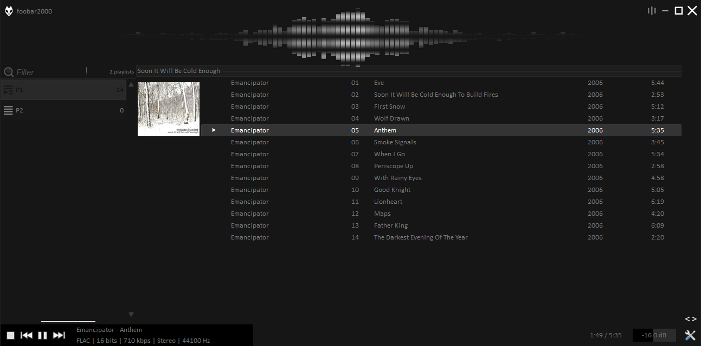
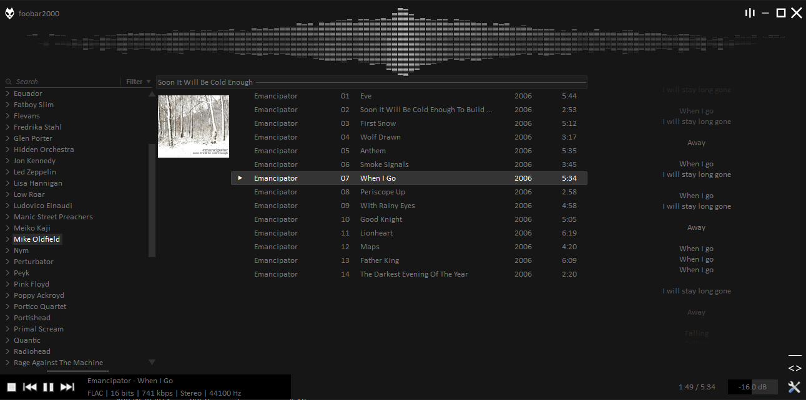
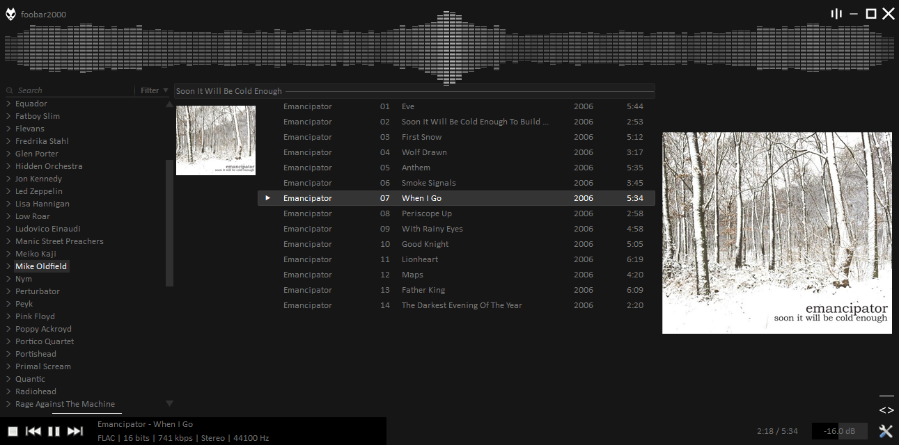

# fb2k-theme
Gok's Foobar2000 theme 

It's an old project from 2015 and it first appeared on [a reddit post](https://www.reddit.com/r/foobar2000/comments/4kwydy/after_5_years_of_using_foobar2000_i_just_learned/).







## Functionality

It has multiple library/playlist views with optional lyrics/big cover art panel. Also includes again optional channel spectrum visualiser.


## Requirements
```
ColumnUI - foo_ui_columns

ESPlaylist - foo_uie_esplaylist

Jscript Panel - foo_jscript_panel

Lyric Show 3 - foo_uie_lyrics3

Panel Stack Splitter - foo_uie_panel_splitter

Channel Spektrum Panel - foo_uie_vis_channel_spectrum

Youtube Source - foo_youtube

UIHacks - foo_ui_hacks
```

Additionally, js scripts are taken from;

[js_marc2003](https://github.com/phts/js_marc2003)

[js_br3tt](https://www.deviantart.com/br3tt/art/JS-Smooth-Browser-571376160)


## Installation

Use the fcl or fth or use the appdata dump on release.

 Last tested on foobar2000 1.4.
